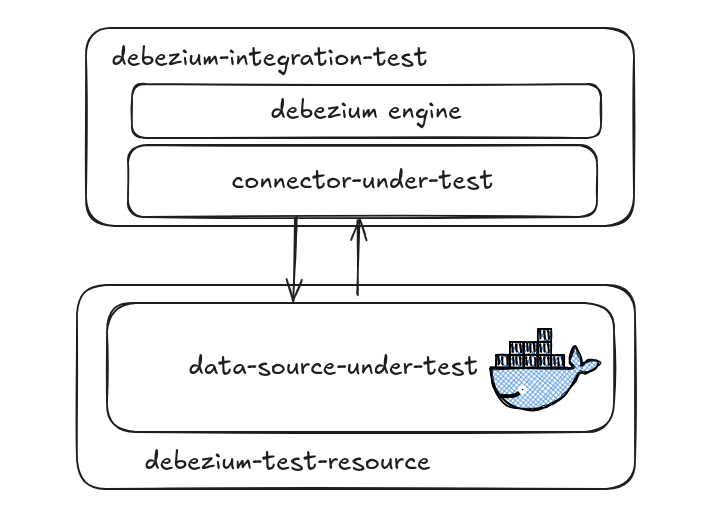
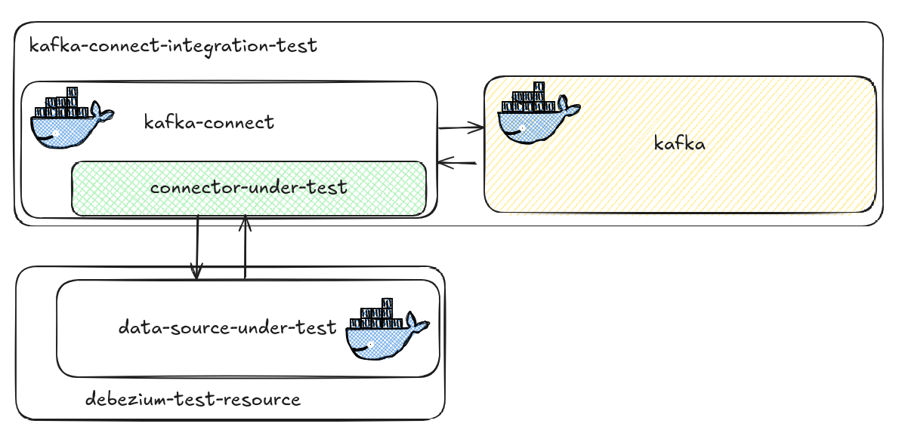

# junit-debezium

Junit5 extension for Debezium Connectors. Strongly inspired by [testing in quarkus](https://quarkus.io/guides/getting-started-testing).


## Installation

add the dependency in your `pom.xml`:

```xml
        <dependency>
            <groupId>io.debezium</groupId>
            <artifactId>junit-debezium</artifactId>
        </dependency>
```

## Introduction

In debezium there are two kind of test (both [integration](https://martinfowler.com/articles/practical-test-pyramid.html)):

- `DebeziumIntegrationTest`: tests against `source -> connector -> debezium engine`
- `KafkaConnectIntegrationTest`: tests against `source -> connector-> kafka connect`

## Debezium Integration Test

Debezium Integration Test is a kind of test that verify the interaction between a _`Connector under test`_ and _Debezium Engine_.



### 1.Quick Start

To test a Connector, annotate your test with `@DebeziumIntegrationTest` add the connector under test and a source in this way:

```java
@DebeziumIntegrationTest(value = ConnectorUnderTest.class, resources = { TestResource.class })
public class DebeziumConnectorTest {

    @Test
    @DisplayName("should debezium engine running with additional configuration")
    public void shouldEngineRunningWithAdditionalConfiguration() {
        // something happens...
    }
}
```

a source can be defined as a `DebeziumTestResourceLifecycleManager` in this way:

```java
public class TestResource implements DebeziumTestResourceLifecycleManager {
    private static final String POSTGRES_IMAGE = "quay.io/debezium/postgres:15";

    private static final DockerImageName POSTGRES_DOCKER_IMAGE_NAME = DockerImageName.parse(POSTGRES_IMAGE)
            .asCompatibleSubstituteFor("postgres");

    private static final PostgreSQLContainer<?> postgresContainer = new PostgreSQLContainer<>(POSTGRES_DOCKER_IMAGE_NAME)
            .waitingFor(Wait.forLogMessage(".*database system is ready to accept connections.*", 2))
            .withUsername("postgres")
            .withPassword("postgres")
            .withDatabaseName("postgres")
            .withEnv("POSTGRES_INITDB_ARGS", "-E UTF8")
            .withEnv("LANG", "en_US.utf8")
            .withStartupTimeout(Duration.ofSeconds(30));

    @Override
    public Map<String, String> start() {
        try {
            postgresContainer.start();

            return Map.of(
                    "database.hostname", postgresContainer.getHost(),
                    "database.user", postgresContainer.getUsername(),
                    "database.password", postgresContainer.getPassword(),
                    "database.dbname", postgresContainer.getDatabaseName(),
                    "database.port", postgresContainer.getMappedPort(5432).toString());
        }
        catch (Exception e) {
            throw new RuntimeException(e);
        }
    }

    @Override
    public void stop() {
        try {
            if (postgresContainer != null) {
                postgresContainer.stop();
            }
        }
        catch (Exception ignore) {
        }
    }
}
```

### 2. Get Debezium

It's possible to get an engine instance inside the test in this way:

```java
@DebeziumIntegrationTest(value = ConnectorUnderTest.class, resources = { TestResource.class },
        configuration =  {
            @DebeziumConfiguration(name = "aKey", value = "aValue"),
            @DebeziumConfiguration(name = "anotherKey", value = "anotherValue")
        })
public class DebeziumConnectorTest {

    @Test
    @DisplayName("should debezium engine running inside the test")
    public void shouldEngineRunningWithAdditionalConfiguration(JunitDebeziumEngine engine) {
        assertThat(engine.isRunning()).isTrue();
    }
}
```

### 3. Add additional configuration

It's possible to override or inject additional configuration to debezium using the configuration parameter:

```java
@DebeziumIntegrationTest(value = ConnectorUnderTest.class, resources = { TestResource.class },
        configuration =  {
            @DebeziumConfiguration(name = "aKey", value = "aValue"),
            @DebeziumConfiguration(name = "anotherKey", value = "anotherValue")
        })
public class DebeziumConnectorTest {

    @Test
    @DisplayName("should debezium engine running with additional configuration")
    public void shouldEngineRunningWithAdditionalConfiguration(JunitDebeziumEngine engine) {
        assertThat(engine.getConfigurationValue("aKey")).isEqualTo("aValue");
        assertThat(engine.getConfigurationValue("anotherKey")).isEqualTo("anotherValue");

        assertThat(engine.isRunning()).isTrue();
    }
}
```

### 4. Override callback

It's possible to override Debezium callback with the annotation:

```java
@DebeziumIntegrationTest(value = ConnectorUnderTest.class, resources = { TestResource.class },
        connectorCallback = ExampleCallback.class)
public class DebeziumConnectorTest {
    private final ListAppender<ILoggingEvent> logWatcher = new ListAppender<>();

    @BeforeEach
    void setUp() {
        logWatcher.start();
    }

    @Test
    @DisplayName("should debezium engine running with callback")
    void shouldEngineRunningWithCallback() {
        Logger logger = (Logger) LoggerFactory.getLogger(ExampleCallback.class);
        logger.addAppender(logWatcher);

        given().ignoreException(NoSuchElementException.class)
                .await()
                .atMost(5, TimeUnit.SECONDS)
                .untilAsserted(() -> assertThat(logWatcher.list.getFirst().getFormattedMessage())
                        .isEqualTo("Example Callback invoked"));

        logger.detachAppender(logWatcher);
    }
}
```

```java
public class ExampleCallback implements ConnectorCallback {
    private static final Logger logger = LoggerFactory.getLogger(ExampleCallback.class);

    @Override
    public void connectorStarted() {
        logger.info("Example Callback invoked");
    }

}
```

## Kafka Connect Integration Test

Most commonly, you deploy Debezium by means of Apache Kafka Connect. Kafka Connect is a framework and runtime for implementing and operating:

- Source connectors such as Debezium that send records into Kafka
- Sink connectors that propagate records from Kafka topics to other systems



[...]